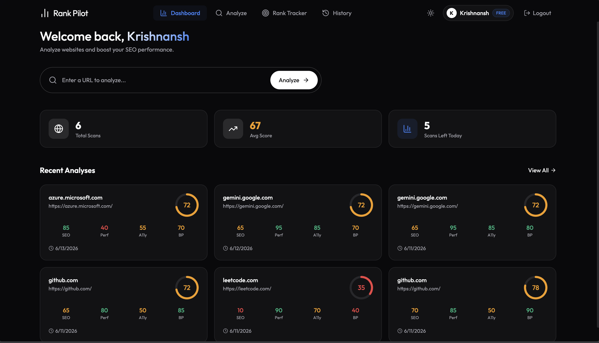
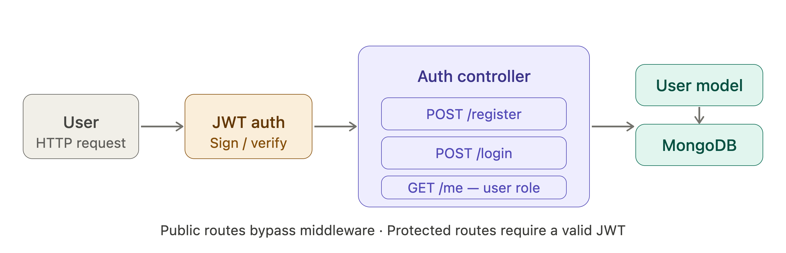
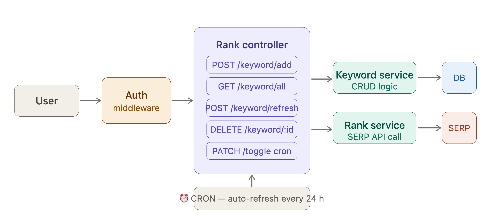
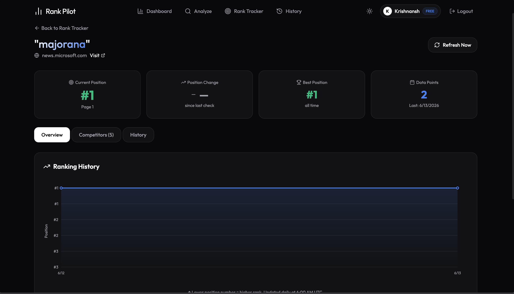
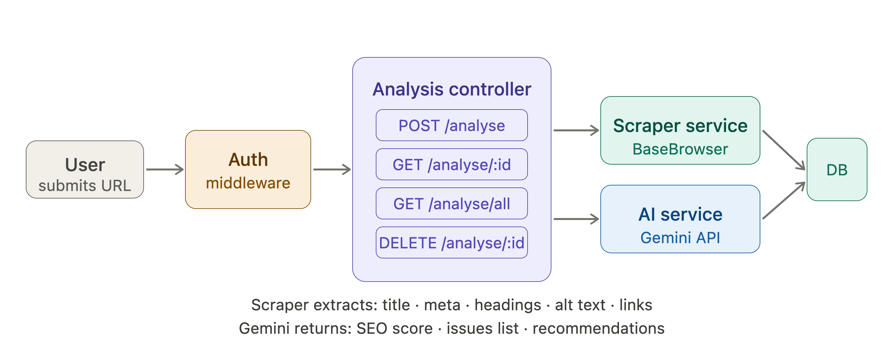
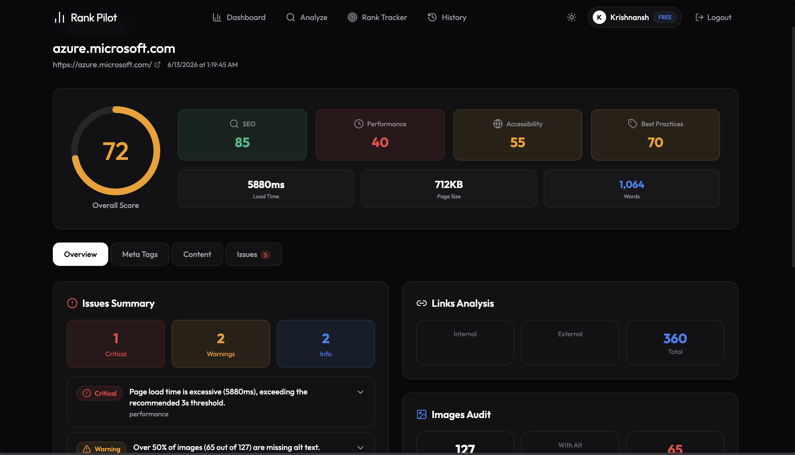
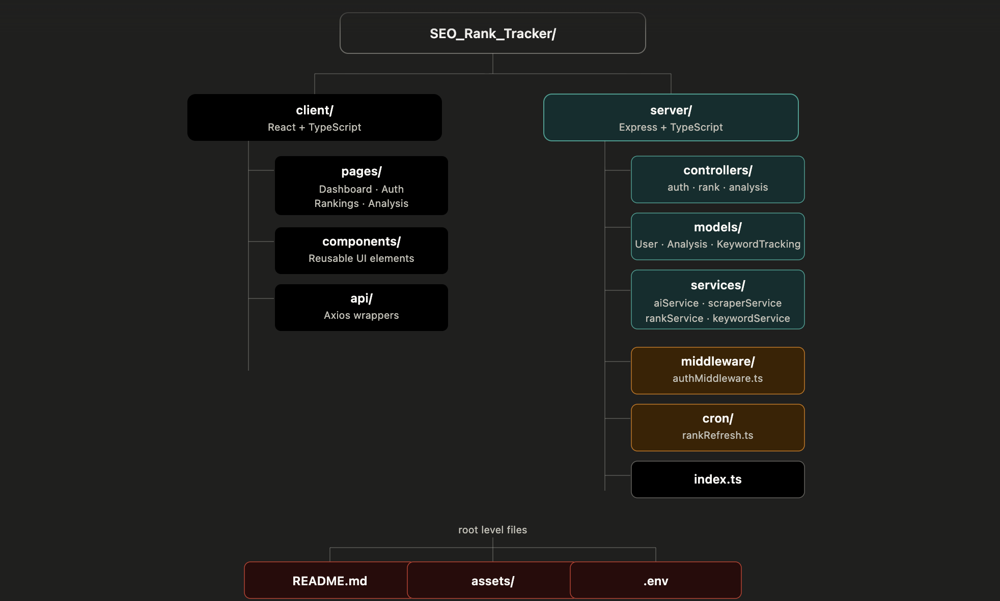

<div align="center">

# RankPilot — AI SEO Rank Tracker

**Track keyword rankings. Audit any site with AI. Deployed on Vercel.**

[](https://seo-rank-tracker-six.vercel.app/)


</div>

---

<!--
  GIF #1 — HERO
  Best shot: login → dashboard → keyword list populating with rank numbers
  Duration: 15–20s · Tool: Kap (macOS) or ScreenToGif (Windows) · Size: < 5MB
-->

<p align="center">
  
  <br>
  <i>Dashboard — Monitor recent website analyses </i>
</p>

---

## What it does

RankPilot is a backend-heavy SEO tool with three core features:

- **Keyword rank tracking** — add any keyword + domain, get its Google rank position. Auto-refreshes daily.
- **AI SEO audit** — paste a URL, get a structured audit (score, issues, recommendations) powered by Gemini AI + a live web scraper.
- **User accounts** — full JWT auth, each user owns their keywords and analyses.

---

## Stack

| | |
|---|---|
| Server | Express.js + TypeScript |
| Database | MongoDB + Mongoose ODM |
| Auth | JSON Web Tokens (JWT) |
| Rank data | SERP API (live Google results) |
| Web scraping | BaseBrowser |
| AI analysis | Google Gemini API |
| Scheduler | node-cron |
| Deploy | Vercel |

---

## Architecture

Three independent backend pipelines. All traffic enters through Express, hits an auth layer, then routes to the right controller.

### 1 — User authentication

<!--
  DIAGRAM: auth_pipeline.svg
  Export the rendered SVG from above (screenshot → trace, or use the PNG below as reference)
  Save to: assets/auth_pipeline.png
-->
<p align="center">
  
</p>

User actions hit the Express server. Public routes (`/register`, `/login`) skip middleware and go straight to the Auth Controller. Protected routes pass through JWT verification first. The controller talks to MongoDB through Mongoose — no sessions, no cookies.

```
POST /register  →  hash password  →  create User doc
POST /login     →  validate creds →  return signed JWT
GET  /me        →  decode token   →  return user + role
```

---

### 2 — Keyword rank tracker

<!--
  GIF #2 — RANK TRACKER
  Best shot: type a keyword + domain → click Add → rank number animates in
  Duration: 20–25s · Show the "Refresh" button triggering a live SERP lookup
  Save to: assets/rank_tracker.gif
-->
<p align="center">
  
  <br><br>
  
</p>

Every request goes through auth middleware. The Rank Controller handles keyword CRUD and delegates the actual rank lookup to the Rank Tracking Service, which calls the SERP API and stores position data to MongoDB.

```
POST   /keyword/add        →  save keyword to KeywordTracking model
GET    /keyword/all        →  return all tracked keywords for user
POST   /keyword/refresh    →  trigger live SERP lookup
PATCH  /keyword/toggle     →  enable / disable CRON auto-refresh
DELETE /keyword/:id        →  remove keyword
```

**How the rank lookup works:**
The Rank Tracking Service sends the keyword to the SERP API, receives the top 100 Google results, scans for the target domain, and writes the position + timestamp back to `KeywordTracking.rankHistory[]`.

**CRON jobs:** Keywords with `isCronEnabled: true` are refreshed automatically every 24 hours using `node-cron`. Users toggle this per keyword.

---

### 3 — AI SEO analysis

<!--
  GIF #3 — SEO ANALYSER
  Best shot: paste URL → click Analyze → loading state → Gemini results appear (score card + issues + recommendations)
  Duration: 20–25s
  Save to: assets/seo_analysis.gif
-->
<p align="center">
  
  <br><br>
  
</p>

User submits a URL. The Analysis Controller runs two services in sequence — the Scraper extracts page content, the AI Service sends it to Gemini, and the full audit result is saved to MongoDB.

```
POST   /analyse        →  scrape URL + run AI audit
GET    /analyse/:id    →  fetch saved analysis
GET    /analyse/all    →  fetch all analyses for user
DELETE /analyse/:id    →  delete analysis
```

**What the scraper extracts:**  title tag · meta description · H1/H2/H3 headings · image alt attributes · internal & external links · load time

**What Gemini returns:**
```json
{
  "score": 74,
  "issues": ["Meta description not found", "3 images missing alt text"],
  "recommendations": ["Add a meta description (150–160 chars)", "Add alt text to all images"]
}
```

---

## Project structure

<p align="center">
  
</p>

---

## Local setup

```bash
git clone https://github.com/KrishnanshPuri/SEO_Rank_Tracker.git
cd SEO_Rank_Tracker

# Backend
cd server && npm install

# Frontend
cd ../client && npm install
```

**Environment variables** — create `server/.env`:

```env
MONGODB_URI=mongodb+srv://<user>:<pass>@cluster.mongodb.net/rankpilot
JWT_SECRET=your_secret
JWT_EXPIRES_IN=7d
SERP_API_KEY=your_serp_api_key
GEMINI_API_KEY=your_gemini_api_key
PORT=5000
```

```bash
# Run backend
cd server && npm run dev

# Run frontend
cd client && npm run dev
```

---

## Deployment

Deployed on Vercel — frontend as a static build, backend as serverless functions.

Live: [seo-rank-tracker-six.vercel.app](https://seo-rank-tracker-six.vercel.app/)

---

<div align="center">
  Built by <a href="https://github.com/KrishnanshPuri">Krishnansh Puri</a>
</div>
